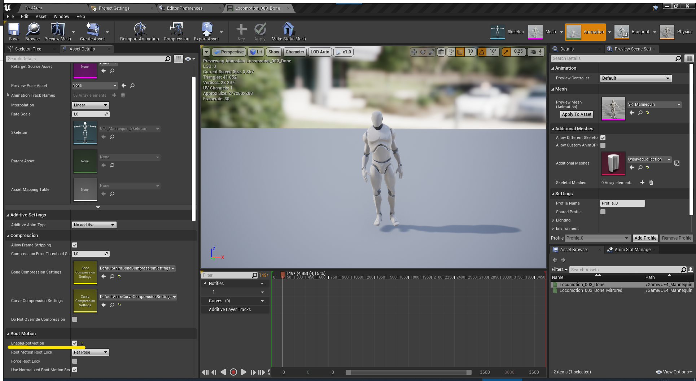
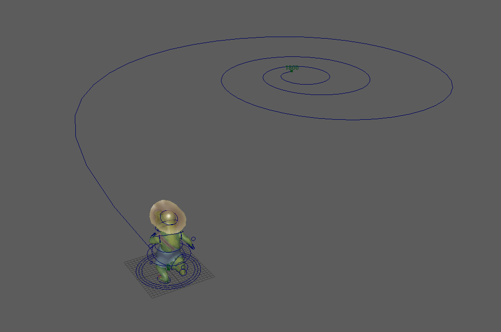

# Character rig & Animation guide

## Character rig requirements

The character rig needs to have a “root”-bone. This root bone needs to have root motion, basically that the character moves through the scene and is not animated in place. The root bone is used by the motion matching system to have a character transform to match current skeletal positions against possible transitinos.

Every animation sequence in Unreal Engine needs to have "Enable Root Motion" enabled under the "Root Motion" category.

## Animation guide

> This guide is mostly intended for hand-keyed "traditionally" animated characters, but some tips might apply to motion capture and or other forms of animation creation.

When working with a limited set of animations you need to be quite exact in making the animation fit the needed character locomotion in the game-scene. Matching movement speed, turning capabilites and using the debug info to add more targeted animations where needed to get good coverage.

The system “prefers” longer sets of animations, to calculate velocity and speed. For example, avoid 1 second animations, but limit them to about 10-15 seconds. Having multiple 10-15 second animations gives insight into what the system is picking in a more easily readable way, given good naming conventions.

Think of creative ways to maximise animation data. Mirroring animations and providing variances give the system more animation data to pull from.

> Example: A tip is to animate a character walking in a spiral for ground locomotion. Start with a one second loop, and loop the animation as the character follows a tightening spline/spiral. To maximize animation data mirror the animation, but not the spiral. Then mirror the spiral and mirrored the walk cycle again. This gives us a lot of animation data, specially turning/walking in different directions, with a one second walk cycle.

Also think of creative ways to “combine” sets of animations. Another one of our examples is a looped crouched walking animation can become anticipation for a jump, if only played for a short while before the jump.
