# User Manual - Unreal Engine motion matching plugin

Return to [front page](./README.md).

## Table of contents

- [User Manual - Unreal Engine motion matching plugin](#user-manual---unreal-engine-motion-matching-plugin)
  - [Table of contents](#table-of-contents)
  - [Intro to setup](#intro-to-setup)
  - [Plugin contains](#plugin-contains)
  - [Unreal Input setup](#unreal-input-setup)
  - [Character setup](#character-setup)
    - [NPC Character setup](#npc-character-setup)
  - [Event graph character setup](#event-graph-character-setup)
  - [Motion field setup](#motion-field-setup)
  - [Adding animations](#adding-animations)
  - [Animation Blueprint setup](#animation-blueprint-setup)
  - [Animation blueprint event graph setup](#animation-blueprint-event-graph-setup)
  - [Multiple Motion Fields per Character](#multiple-motion-fields-per-character)
  - [Debug hud setup](#debug-hud-setup)

## Intro to setup

This guide will help you get a basic player-controlled character, animated using motion matching up and running in game. There is also an NPC variant that mostly follows the same procedures, with the difference being how input is handled.

Start by importing the Motion Matching plugin into Unreal Engine. For now the plugin supports Unreal Engine version 4.27.2.

Unreal has this [documentation](https://docs.unrealengine.com/5.0/en-US/working-with-plugins-in-unreal-engine/) for Unreal 5 - but it should apply to 4.27 as well.

## Plugin contains

- MotCharacter - character class
- Motion Field - “database” and editor-window
- Motion Matching node for animation blueprints

> See also documents regarding [Character rig and Animation specs](./RigAndAnimationSpecs.md) & [User guide](./UserGuide.md).

## Unreal Input setup

Input mapping used in our project settings.

[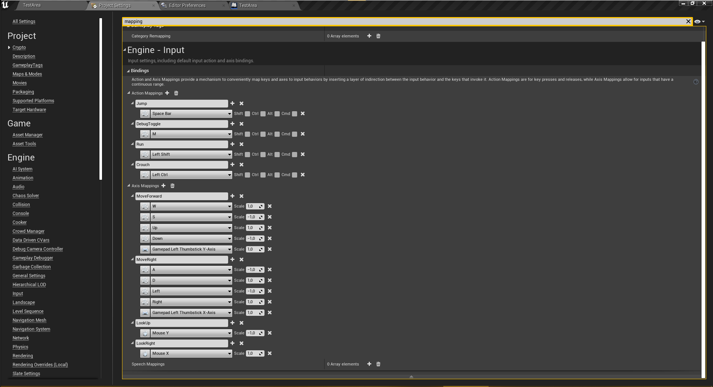](https://gautersamuelsen.github.io/MotionMatching-Documentation/SetupPictures/InputMap.png)

## Character setup

In the Unreal Engine content browser:

- Create a character based on the C++ class "MotCharacter" and give it a suitable name.
- Create an animation blueprint, based on a “regular” animation instance.
- In the “Mesh” section of your blueprint instance of your character, specify the skeletal mesh and the animation blueprint, which uses the same skeletal mesh and includes the motion matching node in its animgraph.

[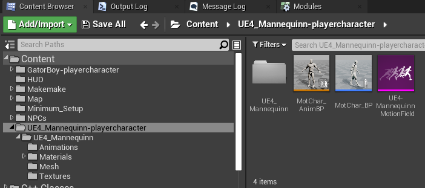](https://gautersamuelsen.github.io/MotionMatching-Documentation/SetupPictures/CharacterSetup.png)

[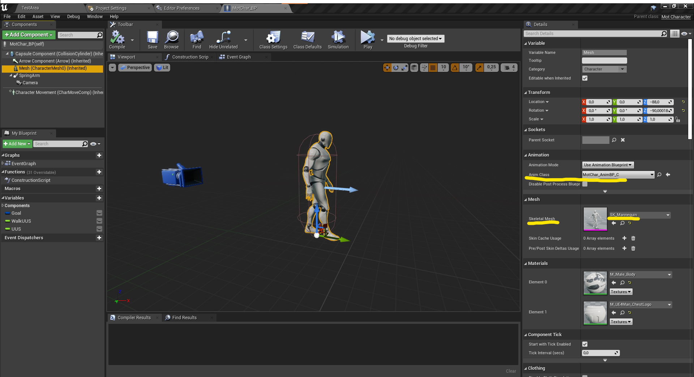](https://gautersamuelsen.github.io/MotionMatching-Documentation/SetupPictures/CharacterBlueprintSetup.png)

## Event graph character setup

In the event graph for the character, the most important part is feeding the motion matching algorithm a target location. The motion matching goal will be the location the system moves towards. This becomes a moving target whenever the player starts moving.

> This example is for a player-driven character, but replacing the input would make it work for npc's.

[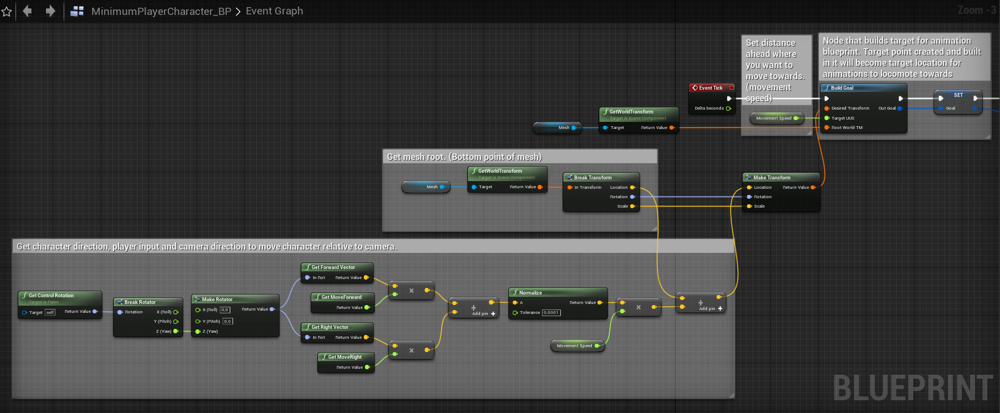](https://gautersamuelsen.github.io/MotionMatching-Documentation/SetupPictures/CharEventGraph.png)

> If you have a camera-arm and camera on your player and want to control camera, place these nodes anywhere in the character event graph blueprint.
> [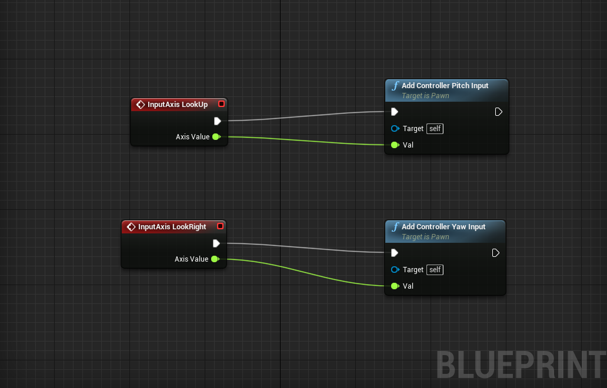](https://gautersamuelsen.github.io/MotionMatching-Documentation/SetupPictures/CameraInput.png)

Another tip is visualising the input.

> Visualizing the input in the game-scene is also a great idea and can be done like this after the goal is built.
> [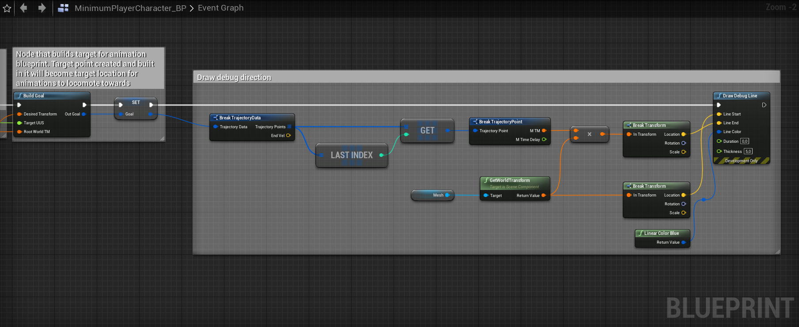](https://gautersamuelsen.github.io/MotionMatching-Documentation/SetupPictures/CharInputVis.png)

### NPC Character setup

Is working in using the same principals, but with some differnt stepss. Instead of the user providing input, Unreals navmesh and pathing system provides the input.

A lot of this will be picture of blueprints loosely categorized by function. Not all of these features are necessary, but might prove useful as a basis for further enhancements. The first picture is the entirety of the setup, but also more detailed pictures are provided.

[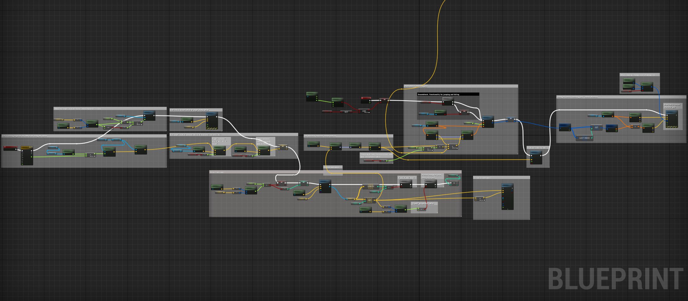](https://gautersamuelsen.github.io/MotionMatching-Documentation/SetupPictures/NpcBlueprintOverview.png)

Variables used for this implementation

[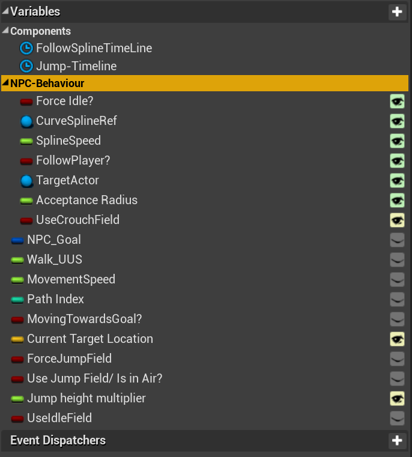](https://gautersamuelsen.github.io/MotionMatching-Documentation/SetupPictures/ExampleOfNPCvariables.png)

Used to set the target along a spline and regulate its speed based on character distance from it. Stops if far enough away.

[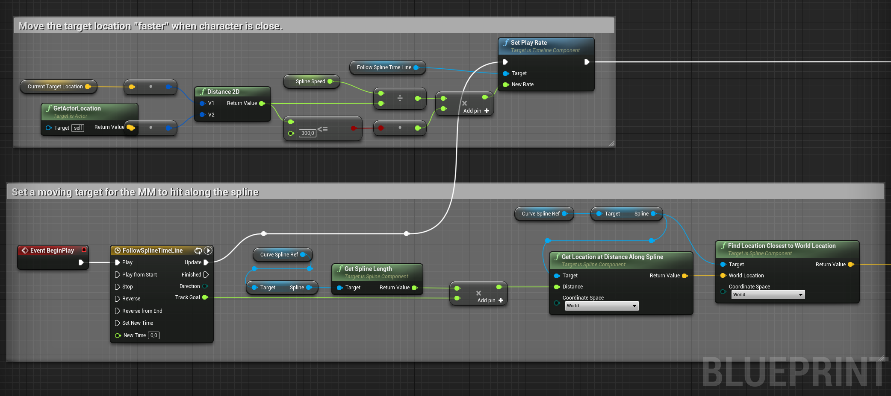](https://gautersamuelsen.github.io/MotionMatching-Documentation/SetupPictures/SplineTargeting.png)

Visualizes goal point along spline and toggles between different goals for the NPC.

[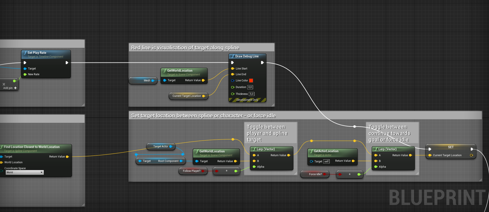](https://gautersamuelsen.github.io/MotionMatching-Documentation/SetupPictures/VisualiseSplineTargetAndTogglesForGoal.png)

NPC pathing logic. Integrated into unreals navmesh and gives the input direction towards next point in path.

[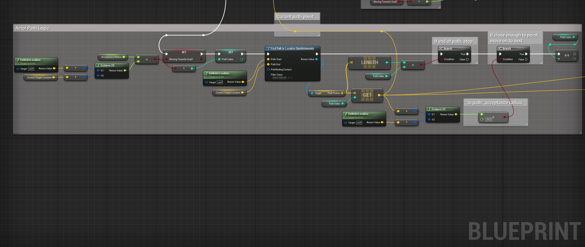](https://gautersamuelsen.github.io/MotionMatching-Documentation/SetupPictures/ActorPathLogic.png)

Visualizes the path in scene as vertical red line.

[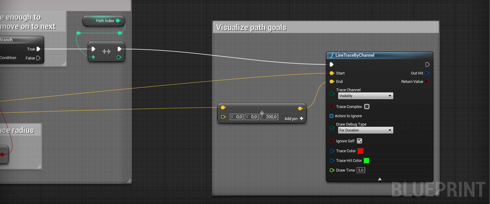](https://gautersamuelsen.github.io/MotionMatching-Documentation/SetupPictures/VisualisePathGoals.png)

How to build the motion matching goal for the NPC and give input direction from the path-logic.

[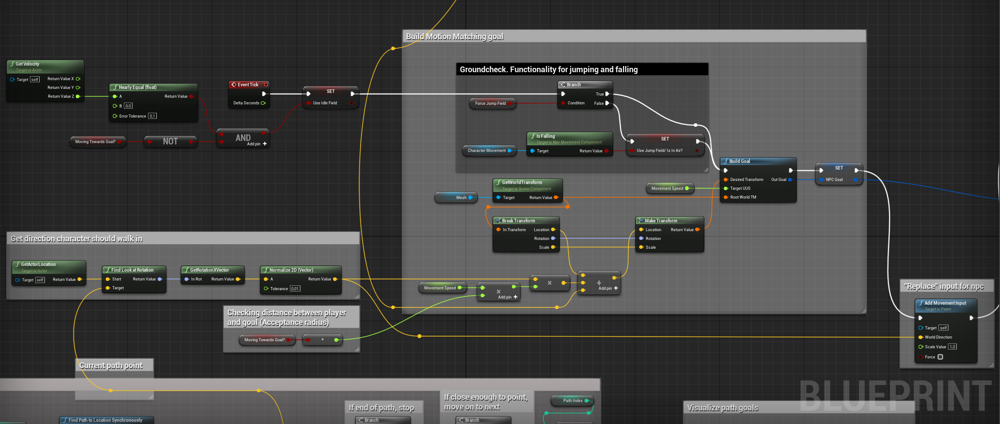](https://gautersamuelsen.github.io/MotionMatching-Documentation/SetupPictures/BuildGoalAndInputDirection.png)

Visualizes the input from the npc towards its goal.

[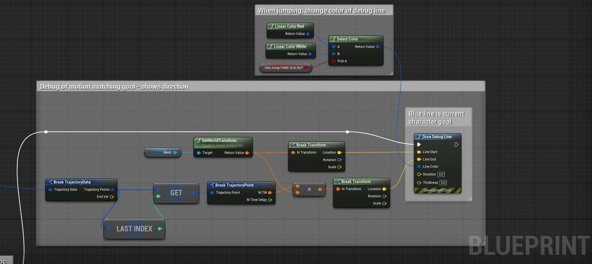](https://gautersamuelsen.github.io/MotionMatching-Documentation/SetupPictures/DrawInputDirection.png)

## Motion field setup

The “Motion field” is a custom data structure, the motion field becomes a database over the “available” animations for the motion matching system. The Motion Field stores the positions, rotations and velocities of the root- and selected skeletal bones, sampled from the pre-made animations provided to it.

To create a Motion Field you right click in the content browser and choose animation -> Motion Field.

[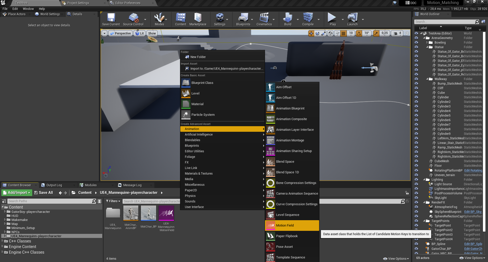](https://gautersamuelsen.github.io/MotionMatching-Documentation/SetupPictures/MotionFieldSetup.png)

When creating, follow the prompts and create the Motion Field based on the skeleton and the tracked bones you want. The system automatically uses the “root” bone of the skeleton, but you can select additional bones.

[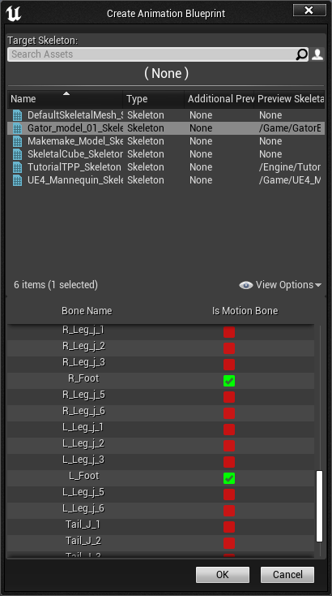](https://gautersamuelsen.github.io/MotionMatching-Documentation/SetupPictures/MotionFieldSettings.png)

If you have a limited or only want to test functionality, select few or no motion bones to debug the system.
For a “normal” amount of animation data, selecting the two feet yields good results.
Feel free to experiment further with this. If you have a huge set of data, for example with motion capture data, then selecting the hip and or neck bone might yield exceptional results.

> Note/bug
> If the character does not appear in the motion field. Place an animation asset with the skeletal mesh you want to create a Motion Field of in a game-scene.

## Adding animations

In the “Motion Field editor” click the button to the right, “Add an animation”. Select the animations you want the character to be able to pull from and use in-game. Grouping motion fields by “state” is a good idea to organize and get ideal results. “Macro” curation of animations is talked about later. But for now grouping motion fields by idle/walk, jumping, climbing, and running makes sure you get the expected animations for the different states.

[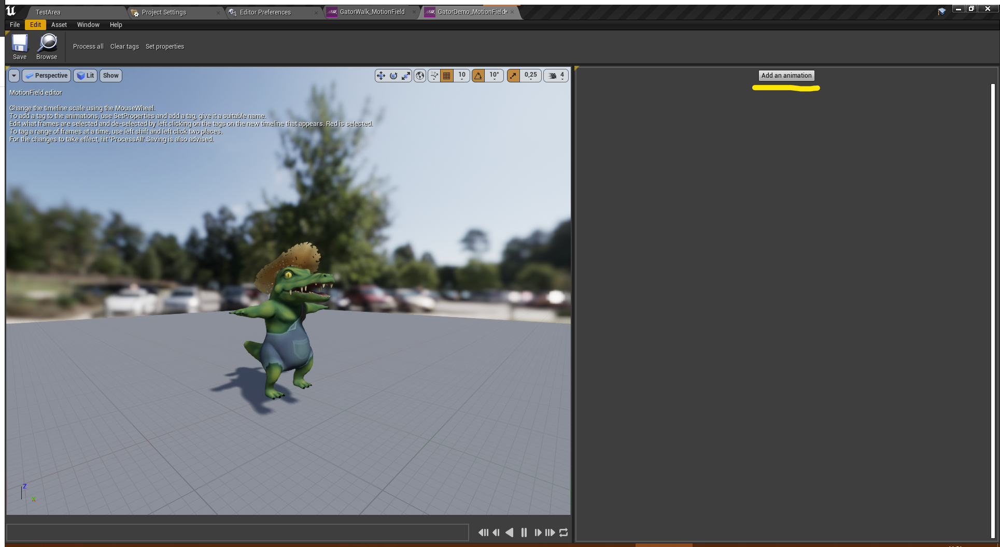](https://gautersamuelsen.github.io/MotionMatching-Documentation/SetupPictures/AddAnimation.png)

To edit how granular and how many motion keys(animation poses) you want the database to sample click on the “Set properties” button. A good starting value is 0,1. The smaller the number, the more samples to pull from and the larger the data-set becomes. A higher number leaves fewer points for the motion matching to match against, and can result in poor animation quality.
A limitation of the system is that the tagging part of it only tags in motion steps, not to actual frames of animation. A smaller timestep means more precision and better results, but can be a bit cluttered and difficult to “read”, especially on smaller screen sizes.

[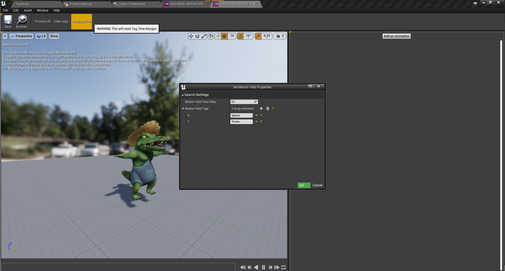](https://gautersamuelsen.github.io/MotionMatching-Documentation/SetupPictures/SetProperties.png)

When the properties are set, and animations imported, click “ProcessAll”, and the Motion Field is ready for use. For the character to animate, the animation blueprint motion matching node needs to know what motion field to pull from.

## Animation Blueprint setup

In the animation blueprint editor, right-click and create a motion matching node. Click the Motion Matching node, then enter the details panel on the right and select the desired Motion Field for the character.

[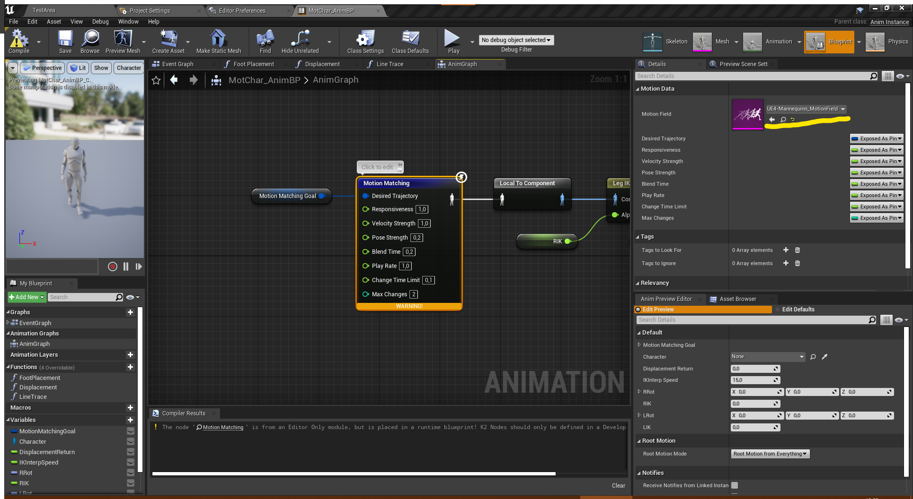](https://gautersamuelsen.github.io/MotionMatching-Documentation/SetupPictures/AnimationBlueprintAnimGraph.png)

> In the animation blueprint’s “Root Motion mode” setting, selecting “Root motion from everything” makes the character move in the game-scene using the root motion data. But if you want to move the character using other code, then ignoring root motion will make the system animate, but not move the character in the scene. With “Root motion from everything” the system will find animations to get the character to the “goal” built in character blueprint.

## Animation blueprint event graph setup

The animation blueprint event graph really only needs to do a couple of things.

- Get a reference to the blueprint instance of itself
- Get and update the motion matching goal

[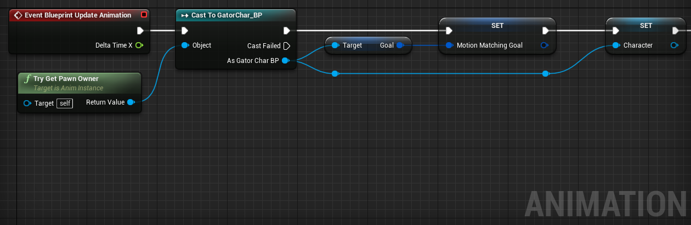](https://gautersamuelsen.github.io/MotionMatching-Documentation/SetupPictures/AnimationEventGraph.png)

## Multiple Motion Fields per Character

To create more “states” of animation it is advised to create more motion fields per character and switch/blend between them as needed. For example in the animation blueprint to have multiple motion matching nodes, and switch between them using logic from the character controller.

In the picture example the character switches to a motion field with run animations. This makes sure that the normal walk animations don't accidentally pick run animations and opposite.

This type of logic can also be used for example when jumping, strafing or when using other distinct forms of movement. Think of this as a “macro” curation, broad strokes.

> Example of simple blending logic

[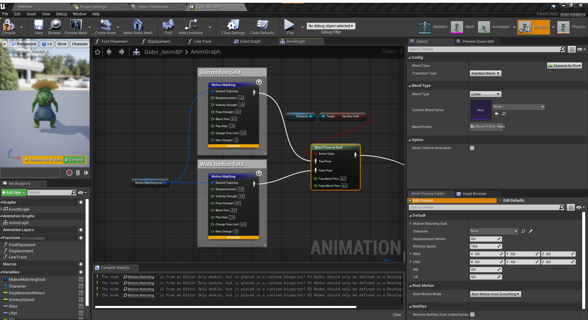](https://gautersamuelsen.github.io/MotionMatching-Documentation/SetupPictures/MultipleMotionFieldsExample.png)

## Debug hud setup

To toggle the debug hud, this can be included into the level blueprint to create a toggle using "m" or your own input setup.

[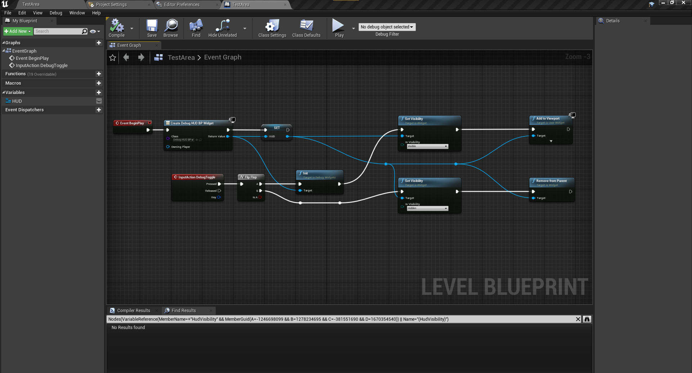](https://gautersamuelsen.github.io/MotionMatching-Documentation/SetupPictures/HUDSetup.png)

Return to [front page](./README.md)
