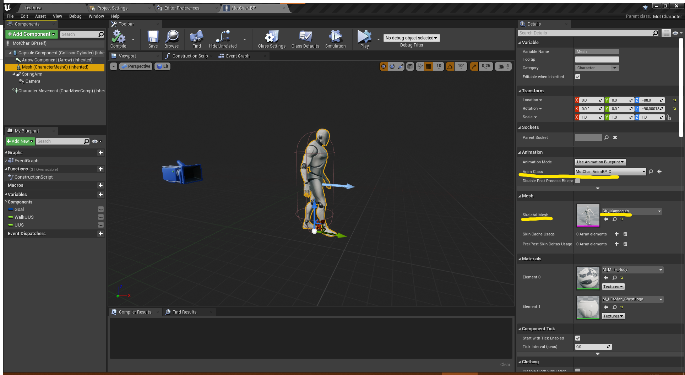

# User Manual - Unreal Engine mation Matching plugin

## Table of contents

(#user-manual---unreal-engine-mation-matching-plugin)
  - [Intro to setup](#intro-to-setup)
    - [Plugin contains](#plugin-contains)
  - [Character setup](#character-setup)
  - [Motion field setup](#motion-field-setup)
    - [Adding animations](#adding-animations)
  - [Animation Blueprint setup](#animation-blueprint-setup)
    - [Event graph setup](#event-graph-setup)
- [User Manual - Unreal Engine mation Matching plugin](#user-manual---unreal-engine-mation-matching-plugin)
  - [Table of contents](#table-of-contents)
  - [Intro to setup](#intro-to-setup)
    - [Plugin contains](#plugin-contains)
  - [Character setup](#character-setup)
  - [Motion field setup](#motion-field-setup)
    - [Adding animations](#adding-animations)
  - [Animation Blueprint setup](#animation-blueprint-setup)
    - [Event graph setup](#event-graph-setup)
- [Intro to useage](#intro-to-useage)
  - [Multiple Motion Fields per Character](#multiple-motion-fields-per-character)
  - [Tag System](#tag-system)
  - [Animation iteration & Debug HUD](#animation-iteration--debug-hud)
  - [Terminology](#terminology)

## Intro to setup

This guide will help you get a basic player-controlled character, animated using motion matching up and running in game. There is also an NPC variant that mostly follows the same procedures, with the difference being how input is handled.

Start by importing the Motion Matching plugin into Unreal Engine. For now the plugin supports Unreal Engine version 4.27.2.

### Plugin contains

- MotCharacter - character class
- Motion Field - “database” and editor-window
- Motion Matching node for animation blueprints

See also Character rig and Animation specs

## Character setup

In the content browser
- Create a character based on the C++ class "MotCharacter" and give it a suitable name.
- Create an animation blueprint, based on a “regular” animation instance.
- In the “Mesh” section of your blueprint instance of your character, specify the skeletal mesh and the animation blueprint, which uses the same skeletal mesh and includes the motion matching node in its animgraph.

## Motion field setup

### Adding animations

## Animation Blueprint setup

### Event graph setup

# Intro to useage

## Multiple Motion Fields per Character

## Tag System

## Animation iteration & Debug HUD

## Terminology
