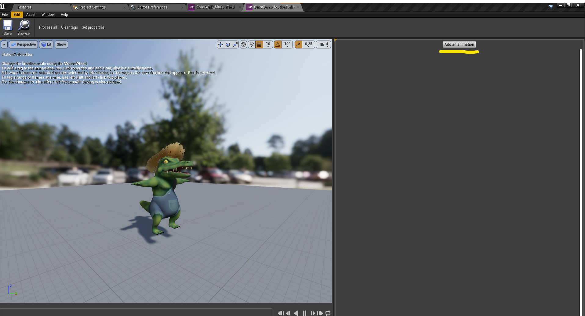

# User Guide

Return to [front page](./README.md).

## Table of contents

- [User Guide](#user-guide)
  - [Table of contents](#table-of-contents)
  - [Intro to useage](#intro-to-useage)
  - [Motion field setup](#motion-field-setup)
  - [Adding animations](#adding-animations)
  - [Tag System](#tag-system)
  - [Animation iteration & Debug HUD](#animation-iteration--debug-hud)
  - [Some common troubleshooting tips](#some-common-troubleshooting-tips)
  - [Terminology](#terminology)
  - [Motion Matching Node in animation blueprints](#motion-matching-node-in-animation-blueprints)

## Intro to useage

This is a guide from working with the system in unreal. This document is meant to help iterate and improve the animation quality of a system that is already set up and running.

## Motion field setup

The “Motion field” is a custom data structure, the motion field becomes a database over the “available” animations for the motion matching system. The Motion Field stores the positions, rotations and velocities of the root- and selected skeletal bones, sampled from the pre-made animations provided to it.

To create a Motion Field you right click in the content browser and choose animation -> Motion Field.

When creating, follow the prompts and create the Motion Field based on the skeleton and the tracked bones you want. The system automatically uses the “root” bone of the skeleton, but you can select additional bones.

If you have a limited or only want to test functionality, select few or no motion bones to debug the system.
For a “normal” amount of animation data, selecting the two feet yields good results.
Feel free to experiment further with this. If you have a huge set of data, for example with motion capture data, then selecting the hip and or neck bone might yield exceptional results.
When creating motion fields for four or multiple legged characters, tracking the front two legs seems to yield good results for all the legs, but experiment.

> Note/bug
> If the character does not appear in the motion field. Place an animation asset with the skeletal mesh you want to create a Motion Field of in a game-scene.

## Adding animations

In the “Motion Field editor” click the button to the right, “Add an animation”. Select the animations you want the character to be able to pull from and use in-game. Grouping motion fields by “state” is a good idea to organize and get ideal results. “Macro” curation of animations is talked about later. But for now grouping motion fields by idle/walk, jumping, climbing, and running makes sure you get the expected animations for the different states.

To edit how granular and how many motion keys(animation poses) you want the database to sample click on the “Set properties” button. A good starting value is 0,1. The smaller the number, the more samples to pull from and the larger the data-set becomes. A higher number leaves fewer points for the motion matching to match against, and can result in poor animation quality.
A limitation of the system is that the tagging part of it only tags in motion steps, not to actual frames of animation. A smaller timestep means more precision and better results, but can be a bit cluttered and difficult to “read”, especially on smaller screen sizes.

When the properties are set, and animations imported, click “ProcessAll”, and the Motion Field is ready for use. For the character to animate, the animation blueprint motion matching node needs to know what motion field to pull from.

## Tag System

The tag system works by “dividing” the animation into the set time steps of the Motion Field. When the "tag” is red, it is selected, and white de-selected. When the timeline below is added to the “tags to ignore” function in the motion matching node in the animation blueprint, the motion matching will ignore animations from about frame 105 to 120.

> A tag with cost "0.0" will always be ignored and removed from the system. 

A part of the motion matching system is giving away absolute control over animations to an algorithm, so to yield the best results, curation of the animations is important. By selectively limiting the searching points of the algorithm it can pick visually better results. Tagging the animations can also be used to stop repeated picking of animations. If a character stutters during a turn or is stuck in a loop of animations, putting a ignore tag on it will keep it out of the searching process.

> In the animation blueprint you need to specify what tags to look for and what tags to ignore.
> 
> In this example case, the ignore has tag index 0 and prefer has tag index 1.

## Animation iteration & Debug HUD

A tool to aid in this is the debug hud. You can toggle this when running the editor in a level by hitting the “m” key. The arrows-boxes below the "motionfield name" can be used to debug different motion fields in the scene. It is advised to debug motion characters one by one, so there are few characters in the scene and you can quickly identify the character with the motion field you seek info on. You can use the debug while playing to test simple things, but it could be smart to do some screen recording to be able to view frame by frame and analyze situations.

The hud shows three important debug info: The animation name, the timestep it has jumped to, and how good of a match it was to the previous animation pose. The lower the number in “Animation match” the better it matched the previous pose.

> A high animation match number between two pieces of animation does not necessarily mean a poor visual result, so using some intuition and analysis of the transitions is needed to not animate every time the animation match is high, but only when truly needed.

Working with the tag system as well can improve the visual results. Even given all beautiful frames of animation the context in which they are chosen dynamically can single out transitions and selections that don’t flow well together. Giving the motion matching “preferred” frames and frames to ignore can aid in its selection. This "micro" curation can be used to avoid playing the same few frames of animations over and over, as well as characters stuck in poses.

## Some common troubleshooting tips

- If the character is not moving in the scene when it should, try increasing movement speed.
- Idle animations can be tricky, if they play poorly try making an idle field which tracks the parts of the body actually moving during the idle. For example the head and or tail might move more than the feet during an idle. Highlighting the "poses" using the tag system might help, but can also produce jittery/unatural looking motion.
- If the "add an animation" button in the motion field editor does not work and crashes the engine: Double check that there are valid skeletons on all imported animations, for all characters. Hopefully only the latest imports have failed. Retargeting/re-importing fixes it.
- Characters don't need their own unique motion fields for the same content, but the debug-hud might give incorrect info or even crash the entire project if there are multiple characters using the same motion field while debugging.

## Terminology

- Motion Matching - Searches through a database of animations to find the pieces of animation that best suit the current skeletal position and match against a future “goal”. In unreal, works as a “Replacement” of animation state machines.
- Database - A database is an organized collection of structured information, or data,
- Motion field - Database of animations. Searched through by the motion matching algorithm.
- Motion field editor - Custom unreal editor to edit the database of animations
- Motion field timestep - How many times to sample the animations per second. The timestep determines how many points are available to jump to and how granular you can set tags.
Animation tags - A way to inform the system of how to handle frames of animations. F.eks “ignore” or “prefer” tags will influence the final result of the animation output.
- Root bone - First bone/socket in animation skeleton
- Root motion - Animated positional offset in animation, our system needs root motion to “move” the character about in the scene.
- Animation time - The timestep the animation the system picked to “jump to”
- Animation match - A “score” of high well the new animation matches the current position of the skeleton. Lower is better, but higher is not necessarily bad visually.
- Micro - Small scale, moment to moment.
- Macro - Big scale, broad strokes.
- UUS - Unreal Unit Speed/Second. Movement speed.

## Motion Matching Node in animation blueprints

- Desired Trajectory - Input of Motion Matching Goal. What transform is the system aiming to match to.
- Responsivness -
- Velocity strength - Adjust the velocity % of speed. If you want the character velocity to differ from the one “animated” into the root motion bone of the animations
- Pose Strength -
- Blend Time - How long to blend between old and new pose. Setting to 0 will show how often system pick different animations. Tuning and finding the right number for the animation set and character set is hugely important.
- Play Rate - Speed of animations.
- Change Time Limit - How often the system allows swapping between animations. Lower number is more responsive, but more “choppy” visually. Tuning this number has huge impact on visual output and responsiveness
- Max Changes - How many changes are allowed in the Change Time Limit duration. Huge impact on output.

Return to [front page](./README.md)
